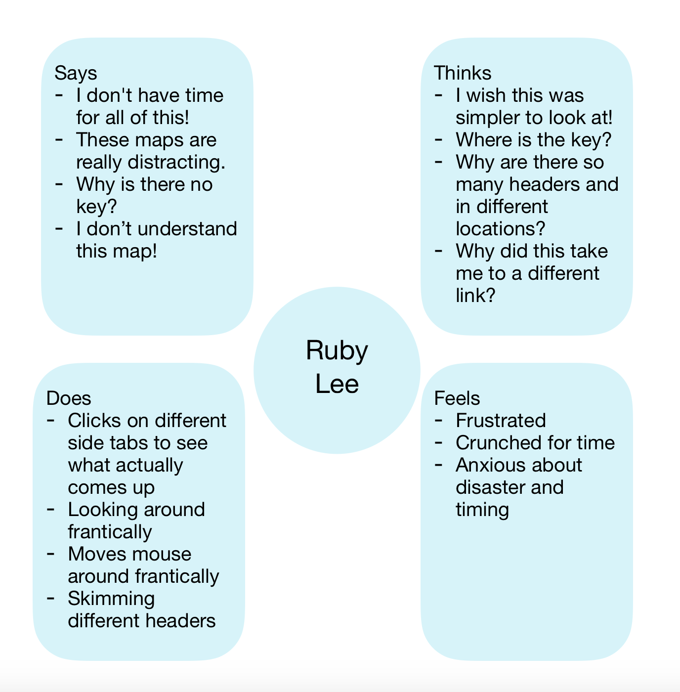

# DH15-Assignment05
## Emily DiPressi 

## Persona 1

### Empathy Map

## Persona 2

### Empathy Map

## Persona 3

### Empathy Map

## Scenario 1
### Lola and 

## Scenario 2
### Clark and Temperature 
* Clark, a single dad, is in charge of getting his kids ready for school. He has three young children and mornings are hectic. In the past he has sent his kids to school without rain jackets because it didn’t look like it would rain, but then the weather changed and his kids were soaked because they didn’t have jackets, boots, or umbrellas. Clark felt responsible for his kid’s lack of preparedness. He wants to do better for his kids and find hourly weather reports and precipitation.
* Clark navigates to weather.gov Monday morning before he wakes the kids up. To find the hourly weather report for his area, he first types in his zip code in the top left box where local forecast is clearly labeled. Upon entering his zip code he is taken to a page that has his current weather and  some extra information is given such as humidity and precipitation percentage. He finds “hourly weather forecast” under the tab labeled “more information”. He clicks that and is taken to a page of the same design. He is presented with a large, readable graph that has temperature clearly marked out each hour in a color that he can see. He happily leaves the site and leaves with knowing how the days temperature will change along with the chance of rain. He is able to dress his children appropriately. 

## Scenario 3
### Ruby and Wildfires 
* Ruby is an undergraduate student in Los Angeles. During her time at school, the Los Angeles area has experienced many fires. Some being very dangerous and had some student evacuate the campus. Ruby is from out of state, so she is not used the the fire experience as many people on the west coast are. These fires have been very scary for her and anxiety inducing. She recently discovered weather.gov and saw that she could see information on fires in her area. 
* Ruby wants to look at the fires and any warnings in her area to be prepared for the future. Ruby navigates to “Safety” at the top of the page, she then gets to a page with a lot of icons, she finds “wildfires” and clicks on that. She is then taken to a page with a small box for images and there is a strip of tabs at the top that has options for her to click on. She finds “Watch vs. Warning” and clicks on this. When clicking on that, a new map comes up of the US with different sections colored based on watch or warning. The map is easy to read and the colors make sense. To exit, Ruby click on the “Home” tab and it take her back to the page that appeared when she logged on. She exits the website easily knowing that her area is not under fire watch or warning. 

